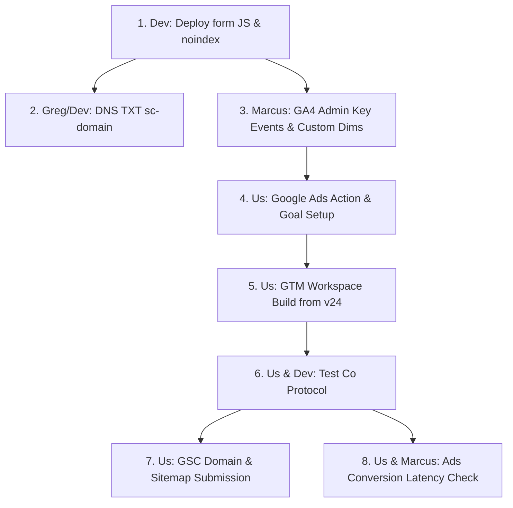

## Status board

| Item | Status | Evidence line |
|---|:---:|---|
| Dev dataLayer push / thank-you redirect | **NOT DONE** | Live HTTP inspection: `/contact-us` form retains `@submit.prevent="submitForm"` posting via `fetch` to `/!/forms/contact_form` with inline `this.success = true`; no redirect and no `dataLayer.push` exists. `/thank-you` returns HTTP 200 on apex, but no form routes to it (`owner-checks.md §1`). |
| GTM triggers + tags | **NOT DONE** | Container `GTM-KXGD4GM` v24: zero references to `contact_enquiry` or `Main-site Enquiry`. Only legacy trigger Predicate 8 (`https://www.ergoworksconsulting.com.au/thank-you/`) for Tag 7 (`Make an Enquiry SR`) and Predicate 13 (`direct_enquiry`) for LP Tags 14 & 16 exist (`gtm.js` JSON analysis). |
| GA4 key events (`direct_enquiry`, `phone_click`) | **NOT DONE** | GA4 API `run_report` (property `316175981`, 2026-08-01–2026-09-07): `direct_enquiry` (3 events) and `phone_click` (1 event) return `keyEvents: 0`. Only legacy `Make an Enquiry SR` (7), `Phone Click SR` (6), and `Email Click SR` (1) have `keyEvents > 0`. `contact_enquiry` has 0 events. |
| GA4 custom dims (`service_type`, `team_size_band`, `timeframe_band`) | **NOT DONE** | GA4 API `get_custom_dimensions_and_metrics`: only 5 custom dimensions exist (`brand_variant`, `event_category`, `event_id`, `event_label`, `lead_id`). `service_type`, `team_size_band`, and `timeframe_band` are absent (`ga4-custom-dims-register-2026-09.md`). |
| Hostname exclusion / internal traffic | **NOT DONE** / **UNVERIFIED** | GTM v24: Tag 5 (`G-LQCWNK3M2K`) fires on all `gtm.js` without exclusion (Rule 1). No blocking trigger `EX - Non-production hostnames - GA4` exists. GA4 internal traffic data filter status is unverified via read-only Data API; GA4 sessions for 2026-09-01–2026-09-08 still recorded 1 session on `www` alongside 489 on apex. |
| Ads "Main-site Enquiry" action | **NOT DONE** (GTM) / **UNVERIFIED** (Ads) | GTM v24 contains no conversion tag for a new main-site enquiry action (only Tag 16 for LP Lead action `7729215501`). Ads account `9258098368` action status is unverified directly without an Ads tool. |
| Staging noindex | **NOT DONE** | `curl -sI` against all three staging hosts returns HTTP 200 with no `X-Robots-Tag` header: `https://ergoworks-consulting.on-forge.com/`, `https://loving-panther-952645.framer.app/`, and `https://ergonomic.ergoworks.com.au/`. |
| GSC domain property + sitemap | **NOT DONE** | GSC API `list_properties`: `sc-domain:ergoworksconsulting.com.au` is missing (only `https://www.ergoworksconsulting.com.au/` exists). `get_sitemaps`: only legacy `sitemap_index.xml` exists (last downloaded 2026-08-23, status "Has errors", 1 error, 1 warning, 430 URLs), while the live endpoint is `/sitemap.xml` (168 URLs; `sitemap_index.xml` returns 404). |

---

## GTM container findings

Inspection of published container `GTM-KXGD4GM` v24 (`https://www.googletagmanager.com/gtm.js?id=GTM-KXGD4GM`, 471 KB) against the tracking skills (`audit-tracking.md §5` tags, pixels, and triggers; `analytics/SKILL.md` validation checklist) reveals:

1. **Triggers and tags referencing key events:**
   - `thank-you/`: Predicate 8 evaluates `_cn` (contains) `https://www.ergoworksconsulting.com.au/thank-you/`. In Rule 5, it fires Tag 7 (`Make an Enquiry SR`, GA4 event tag overriding to `G-LQCWNK3M2K`). This trigger requires the legacy `www` subdomain and trailing slash. The live apex `/thank-you` does not match.
   - `direct_enquiry`: Predicate 13 checks `_event == "direct_enquiry"`. Rule 9 (combined with Predicate 10 hostname regex) fires Tag 14 (GA4 `direct_enquiry`) and Tag 16 (Google Ads conversion tracking tag `__awct`, conversion ID `867987507`, label `pp86CI3wyeUcELPg8Z0D`, value A$1.00, order ID mapped to `event_id`). Tag 16 represents the secondary action `Ergoworks LP Lead` (`7729215501`).
   - `form_submit`: Zero triggers or tags. Strings found in the container (`FORM_SUBMIT_PERMISSION_DENIED`, `detect_form_submit_events`) are internal engine constants. No `gtm.formSubmit` listener is active.
   - `generate_lead`: Zero triggers or tags. Appears only in compiled GA4 recommended event dictionaries.
2. **DataLayer push matching:**
   - The container contains **no trigger** for `contact_enquiry`. If dev deploys `event: 'contact_enquiry'` before GTM is updated, **nothing will fire**.
   - If dev were to push `event: 'direct_enquiry'`, it would immediately fire Tag 14 (GA4) and Tag 16 (Ads LP Lead). However, Tag 16 maps to the LP conversion action, and Tag 14 maps parameters (`service_type`, `team_size_band`, `timeframe_band`) absent from `/contact-us`.
3. **Mismatches between spec (`tracking-fix-spec.md`) and live container:**
   - *GA4 config tag scope:* The spec instructs using the "existing GA4 config tag that serves the main site" and suggests `G-LQCWNK3M2K` might be LP-only. In reality, Tag 5 (`__googtag`, ID `G-LQCWNK3M2K`) is the **sole** GA4 config in the container, and all tags (Tags 3, 4, 6, 7, 11, 12, 14, 18) override to `G-LQCWNK3M2K`. There is no separate main-site GA4 stream.
   - *Ads conversion mechanism:* `Make an Enquiry SR` (Tag 7) has no direct Ads tag; it was an imported GA4 conversion. The spec correctly mandates a direct Google Ads conversion tag for `Main-site Enquiry`.

---

## 02/09 event

GA4 `run_report` for `2026-09-02` (property `316175981`) filtered to `eventName = 'direct_enquiry'`:
- **Event:** `direct_enquiry` (`eventCount: 1`, `keyEvents: 0`)
- **Page path:** `/corporate-ergonomic-consulting` (**the LP on apex**)
- **Host name:** `ergoworksconsulting.com.au`
- **Session source / medium:** `google / cpc`
- **Campaign:** `SEARCH_SYD_Ergonomics-Assessment_2026Q3` (Campaign ID `24158353407`)

### Test vs real indicators (no PII)
- **Indicators leaning real:**
  - Paid entry: arrived via a Google Ads ad click (`google / cpc`) that billed A$41.27 for 1 click on 02/09 (`owner-checks.md §5`).
  - Technical profile: Windows desktop, Google Chrome, Sydney location (`run_report` technical breakdown).
  - Funnel progression: logged standard user sequence in GA4 on `/corporate-ergonomic-consulting`: `first_visit` $\rightarrow$ `session_start` $\rightarrow$ `page_view` $\rightarrow$ `scroll` $\rightarrow$ `form_start` $\rightarrow$ `user_engagement` $\rightarrow$ `direct_enquiry`.
- **Indicators leaning test / unverified:**
  - GA4 recorded `keyEvents: 0` because `direct_enquiry` has not been marked as a key event in GA4 Admin.
  - Ads action `Ergoworks LP Lead` (`7729215501`) recorded 1 conversion in `all_conversions` on 02/09 (`ads.md §3`), but action-level reporting lagged.
  - Timing aligned with agency and internal audit activity on 02/09 (`owner-checks.md §1`).
  - **Verdict:** Leans genuine corporate prospect, but final classification is unverified until Greg cross-checks form submissions in the CRM/inbox for 02/09.

---

## Cut-over runbook

Execute in strict sequential order.

### Step 1: Dev deployment
- **Owner:** Dev (Joel)
- **Action:** Deploy the Statamic/Alpine `contact_form` and `newsletter` dataLayer pushes with submission locks and deduplication guards (`tracking-fix-spec.md §1`). Add `X-Robots-Tag: noindex, nofollow` to Nginx on `ergoworks-consulting.on-forge.com`.
- **Check:**
  - `curl -sI https://ergoworks-consulting.on-forge.com/ | grep -i x-robots-tag` $\rightarrow$ Expect `X-Robots-Tag: noindex, nofollow`.
  - Browser inspection on `/contact-us` $\rightarrow$ Expect `window.dataLayer` push of `contact_enquiry` containing `form_id`, `enquiry_about`, `state`, `event_id`, `lead_id`.

### Step 2: DNS verification for GSC domain property
- **Owner:** Greg / Dev
- **Action:** Add DNS TXT record at domain registrar:
  - Record Type: `TXT`
  - Host/Name: `@` (or `ergoworksconsulting.com.au.`)
  - Value: `google-site-verification=<TOKEN_FROM_GSC_UI>`
- **Check:** `dig +short TXT ergoworksconsulting.com.au` $\rightarrow$ Expect string containing the verification token.

### Step 3: GA4 Admin configuration
- **Owner:** Marcus
- **Action:** In GA4 (`316175981`):
  1. Admin $\rightarrow$ Events: mark `contact_enquiry`, `direct_enquiry`, and `phone_click` as key events. Leave `form_start` unmarked.
  2. Admin $\rightarrow$ Custom definitions $\rightarrow$ Create custom dimension (Event-scoped):
     - `Service type` $\rightarrow$ `service_type`
     - `Team size band` $\rightarrow$ `team_size_band`
     - `Timeframe band` $\rightarrow$ `timeframe_band`
- **Check:** Run `get_custom_dimensions_and_metrics` $\rightarrow$ Expect 8 custom dimensions total.

### Step 4: Google Ads conversion action setup
- **Owner:** Us (approved by Marcus)
- **Action:** In Ads account `9258098368`:
  1. Create conversion action: Name `Main-site Enquiry`, Category `SUBMIT_LEAD_FORM`, Count `ONE_PER_CLICK`, Value unassigned, Click window 90 days. Installation: Use Google Tag Manager. Note Conversion ID and Label.
  2. Add `Main-site Enquiry` to custom goal `6458792967` ("Ergoworks Consulting - Primary Lead Goals") shared by campaigns `700072710` and `24158353407`.
- **Check:** Verify goal `6458792967` contains the new action ID alongside call actions and LP Lead.

### Step 5: GTM container build & publish
- **Owner:** Us
- **Action:** In `GTM-KXGD4GM`, open a **fresh workspace from published v24**:
  1. Trigger: `CE - contact_enquiry - Main site` (Custom Event `contact_enquiry`, Hostname matches regex `^(www\.)?ergoworksconsulting\.com\.au$`).
  2. Trigger: `CE - newsletter_signup - Main site` (Custom Event `newsletter_signup`, same hostname regex).
  3. Blocking Trigger: `EX - Non-production hostnames - GA4` (Page View, Hostname matches regex `(^|\.)(on-forge\.com|framer\.app|ergonomic\.ergoworks\.com\.au|test)$`).
  4. Tag: GA4 Event `contact_enquiry` (Event Name `contact_enquiry`, Config tag `Tag 5` / `G-LQCWNK3M2K`, parameters `form_id`, `enquiry_about`, `state`, `event_id`, `lead_id`, Trigger `CE - contact_enquiry - Main site`).
  5. Tag: Google Ads Conversion Tracking `Main-site Enquiry` (Conversion ID & Label from Step 4, Trigger `CE - contact_enquiry - Main site`).
  6. Update Tag 6 (`Newsletter Sign Up SR`): add `CE - newsletter_signup - Main site` as firing trigger.
  7. Attach blocking trigger `EX - Non-production hostnames - GA4` to Tag 5 (`__googtag`).
  8. Publish version 25.
- **Check:** Inspect public `gtm.js?id=GTM-KXGD4GM` $\rightarrow$ Expect version `25` and predicate matching `contact_enquiry`.

### Step 6: Test Co verification protocol
- **Owner:** Us & Dev (notifying Marcus & Greg in advance)
- **Action:**
  1. Open Tag Assistant Preview on `https://ergoworksconsulting.com.au/contact-us`.
  2. Submit form with company name `Test Co` and test values.
- **Checks:**
  - Tag Assistant: 1 `contact_enquiry` event; GA4 event tag and Google Ads conversion tag fire exactly once.
  - Payload QA: contains `form_id`, `enquiry_about`, `state`, `event_id`, `lead_id`; zero PII (`name`, `email`, `phone`, `message` absent).
  - GA4 DebugView / Realtime: `contact_enquiry` appears within 15 seconds; marked as key event.
  - Idempotency / Deduplication: refresh `/contact-us` $\rightarrow$ zero events fired. Double click submit $\rightarrow$ lock stops second event.
  - Newsletter: submit test email $\rightarrow$ 1 `newsletter_signup` event; Tag 6 fires.
  - Staging isolation: visit `https://loving-panther-952645.framer.app/` in Preview $\rightarrow$ Tag 5 blocked.

### Step 7: GSC sitemap replacement & domain verification
- **Owner:** Us
- **Action:**
  1. Verify `sc-domain:ergoworksconsulting.com.au` in GSC after Step 2 DNS propagates.
  2. On `https://www.ergoworksconsulting.com.au/` and `sc-domain:ergoworksconsulting.com.au`: delete stale sitemap `https://www.ergoworksconsulting.com.au/sitemap_index.xml`.
  3. Submit live sitemap: `https://ergoworksconsulting.com.au/sitemap.xml`.
- **Check:** GSC API `get_sitemaps` $\rightarrow$ Status "Success", 168 indexed URLs, 0 errors.

### Step 8: Ads conversion verification window
- **Owner:** Us & Marcus
- **Check:** In Google Ads `9258098368`, check `Main-site Enquiry` conversion action.
- **Latency window:**
  - Direct Google Ads tag: converts within **3 hours** in account reporting.
  - GA4 imported actions: require **24–48 hours** processing latency. (Using direct Ads tag bypasses this lag).
- **Rollback:** If unexpected behaviour occurs, revert GTM container to v24 in GTM UI; dev rolls back form handler commit.

---

## Weekly-report pulls check

Dry-run testing of queries from `weekly-report-template.md` against live property `316175981` (window 2026-09-01–2026-09-07) and GAQL review:

| Report section | Target API & query specification | Dry-run result | Breakage / caveat |
|---|---|:---:|---|
| **§1 Leads** | GA4 `run_report`: dims `isoYearIsoWeek,eventName`, metrics `eventCount,keyEvents` | **PASS** | Valid schema. Returns weeks `202636` and `202637`. Caveat: `keyEvents` returns 0 for all current form events until Marcus updates GA4 Admin. |
| **§1 Leads (Ads)** | GAQL: `SELECT campaign.id, segments.week, segments.conversion_action_name, metrics.conversions, metrics.all_conversions FROM campaign WHERE campaign.id IN (700072710, 24158353407)` | **PASS** (schema) | Valid GAQL. Caveat: `Ergoworks LP Lead` (7729215501) is secondary; appears in `all_conversions`, not `conversions`. |
| **§2 Spend & CPL** | GAQL: `SELECT campaign.id, segments.week, metrics.cost_micros, metrics.conversions FROM campaign WHERE campaign.id IN (700072710, 24158353407)` | **PASS** (schema) | Valid GAQL. Standard metrics across Google Ads API v16/v17. |
| **§3 IS & Waste** | GAQL: `search_impression_share`, `search_budget_lost_impression_share`, `search_rank_lost_impression_share`, and `search_term_view` query | **PASS** (schema) | Valid GAQL. Note: zero rows on weekends (5–6 Sep) due to active ad schedule (`owner-checks.md §5`). |
| **§4 Organic** | GSC API `searchAnalytics/query` on `https://www.ergoworksconsulting.com.au/` | **PASS** (schema) | Captures old `www` traffic only (a floor). Misses apex queries until `sc-domain` is verified. |
| **§4 Organic (GA4)** | GA4 `run_report`: dims `isoYearIsoWeek,sessionDefaultChannelGroup`, metrics `sessions,engagedSessions,keyEvents` | **PASS** | Valid schema. Successfully returns Direct (335 sess), Paid Search (72 sess), Organic Search (38 sess) for week `202636`. |
| **§5 Site health A** | GA4 `run_report`: dims `date,eventName`, metrics `eventCount,keyEvents` | **PASS** | Valid schema. Returned 41 daily event rows across 7 days. |
| **§5 Site health B** | GA4 `run_report`: dim `hostName`, metrics `sessions,eventCount`, filter `eventName = page_view` | **PASS** | Valid schema. Returned 489 sessions on apex and 1 on `www`. |

---

## Blockers by owner

### Dev (Joel)
1. **Form dataLayer push:** `/contact-us` Alpine handler not yet deployed with `contact_enquiry` push or thank-you redirect (`tracking-fix-spec.md §1`).
2. **Staging indexation:** `ergoworks-consulting.on-forge.com` lacks `X-Robots-Tag: noindex, nofollow` header (HTTP 200 indexable).

### Marcus
1. **GA4 Admin key events:** Must mark `contact_enquiry`, `direct_enquiry`, and `phone_click` as key events in GA4 Admin $\rightarrow$ Events.
2. **GA4 custom dimensions:** Must register `service_type`, `team_size_band`, and `timeframe_band` in GA4 Admin $\rightarrow$ Custom definitions.
3. **Ads approval:** Approve creation of `Main-site Enquiry` action and its attachment to custom goal `6458792967`.

### Greg
1. **DNS TXT record:** Must add Google site verification TXT record to registrar DNS for `sc-domain:ergoworksconsulting.com.au`.
2. **Inbox verification:** Confirm whether the 02/09 Sydney LP enquiry was a genuine customer lead or internal test.
3. **Test Co approval:** Authorise the one-off `Test Co` test submission for deployment QA.

### Us
1. **GTM workspace build:** Build and publish version 25 from v24 with `contact_enquiry` triggers, tags, and non-production hostname exclusion immediately upon dev deploy.
2. **Ads conversion tag:** Configure direct conversion tracking tag in GTM for `Main-site Enquiry`.
3. **GSC sitemap audit:** Submit `https://ergoworksconsulting.com.au/sitemap.xml` and purge broken `sitemap_index.xml` in GSC.

---

## Sources
- **GA4 Property 316175981:** Data API calls `run_report`, `get_property_details`, `get_custom_dimensions_and_metrics` executed 2026-09-08.
- **Google Search Console:** GSC API calls `list_properties`, `get_sitemaps` on `https://www.ergoworksconsulting.com.au/` executed 2026-09-08.
- **Public GTM Container:** `https://www.googletagmanager.com/gtm.js?id=GTM-KXGD4GM` v24 extracted and parsed 2026-09-08.
- **Public HTTP Endpoints:** `curl -sI` checks on `ergoworksconsulting.com.au`, `ergoworks-consulting.on-forge.com`, `loving-panther-952645.framer.app`, `ergonomic.ergoworks.com.au`.
- **Repo specifications & evidence:**
  - `docs/ergoworks-consulting/greg-review-2026-09-04/deliverables/tracking-fix-spec.md` (§1–§6)
  - `docs/ergoworks-consulting/greg-review-2026-09-04/evidence/owner-checks.md` (§1–§10)
  - `docs/ergoworks-consulting/greg-review-2026-09-04/evidence/gsc.md` (§1, §4)
  - `docs/ergoworks-consulting/greg-review-2026-09-04/deliverables/weekly-report-template.md` (§1–§6)
  - `docs/ergoworks-consulting/ga4-custom-dims-register-2026-09.md`
- **Measurement Skills:**
  - `~/.claude/plugins/cache/marketingskills/marketing-skills/2.11.0/skills/analytics/SKILL.md` (Validation Checklist: correct triggers, property population, duplicate suppression, PII prevention).
  - `~/.claude/plugins/cache/ai-marketing-hub-claude-ads/claude-ads/2.0.1/agents/audit-tracking.md` (§5 conversion taxonomy, tags and pixels, cross-platform reconciliation, attribution latency).

---

### Summary of execution
- **What was checked/found:** Conducted read-only QA across live GA4 (`316175981`), GSC (`https://www.ergoworksconsulting.com.au/`), public GTM container (`GTM-KXGD4GM` v24), and live HTTP headers. Confirmed that the main-site form tracking is completely unlinked in the live container, staging sites lack noindex headers, GSC domain property does not exist, and GA4 key events / custom dimensions are unregistered. Confirmed 02/09 `direct_enquiry` fired on the apex LP via paid search from Sydney, but recorded 0 key events. Verified all GA4 queries in the weekly report template succeed against the live Data API.
- **Files touched:** None (read-only audit; zero working tree modifications).
- **How verified:** GA4 Data API reports run in real time; GSC API verified properties and sitemaps; GTM v24 container JavaScript downloaded and parsed via Python; live endpoints probed via HTTP curl.

[exited with code 0]
